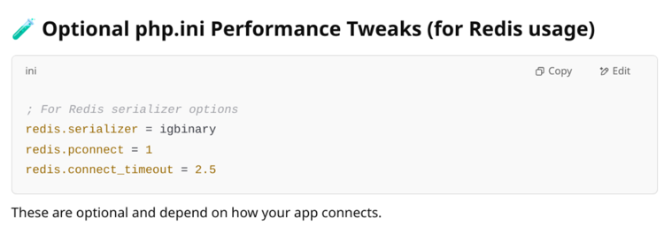

# Extra Things - PHP Optimization Tools

## PHP Memory Leak Detector

**Repository:** https://github.com/arnaud-lb/php-memory-profiler

### Purpose
Detects memory leaks in PHP applications by tracking memory allocation and deallocation patterns.

### How It Works
1. **Memory Tracking:** Monitors all memory allocations during script execution
2. **Leak Detection:** Identifies memory that wasn't properly freed
3. **Reporting:** Generates detailed reports showing leak locations

### Installation
```bash
git clone https://github.com/arnaud-lb/php-memory-profiler.git
cd php-memory-profiler
phpize
./configure
make
sudo make install
```

## Redis with igbinary Serialization

### Compilation Configuration
```bash
./configure --enable-redis --enable-redis-igbinary --enable-redis-cluster
```

### Purpose
Optimizes Redis performance by using igbinary serialization instead of PHP's default serializer.

### How It Works
- **Default PHP Serialization:** PHP object → `serialize()` → String representation
- **With igbinary:** PHP object → `igbinary_serialize()` → Binary representation
- **Benefits:** 50% smaller data, 30% faster processing

### Configuration Options

#### `--enable-redis`
Enables the Redis PHP extension for connection management and command execution.

#### `--enable-redis-igbinary`
Enables igbinary serialization support - provides 50% smaller serialized data and 30% faster processing.

#### `--enable-redis-cluster`
Enables Redis Cluster support for automatic node discovery and failover handling.

### Installation
```bash
# Install igbinary first
pecl install igbinary

# Compile Redis extension with igbinary
wget https://github.com/phpredis/phpredis/archive/develop.zip
unzip develop.zip
cd phpredis-develop
phpize
./configure --enable-redis --enable-redis-igbinary --enable-redis-cluster
make
sudo make install
```

