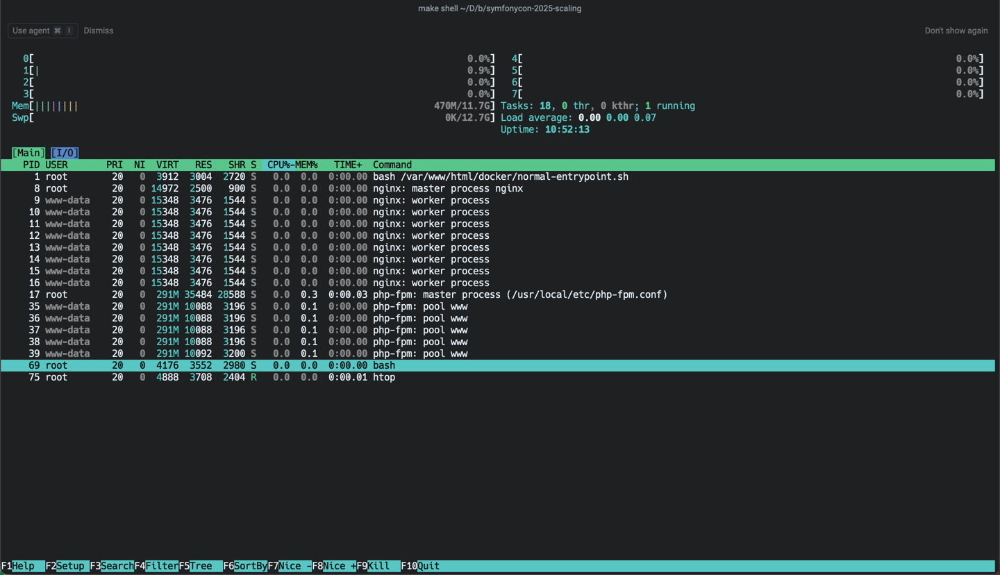
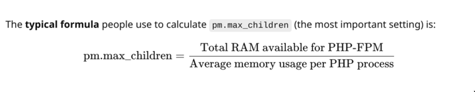
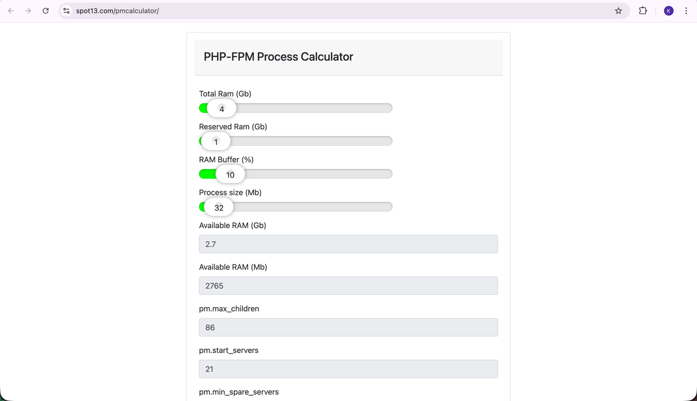
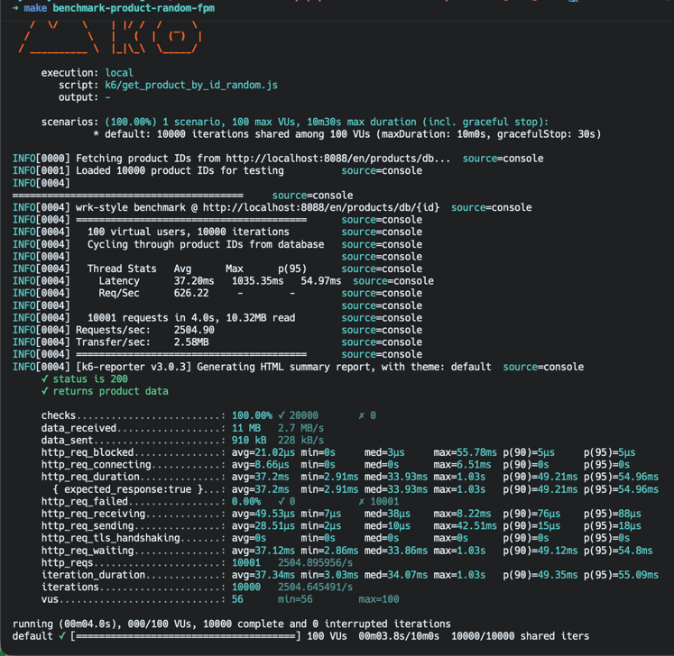
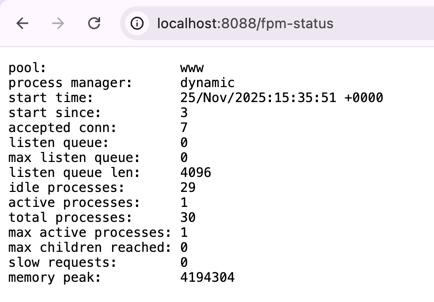
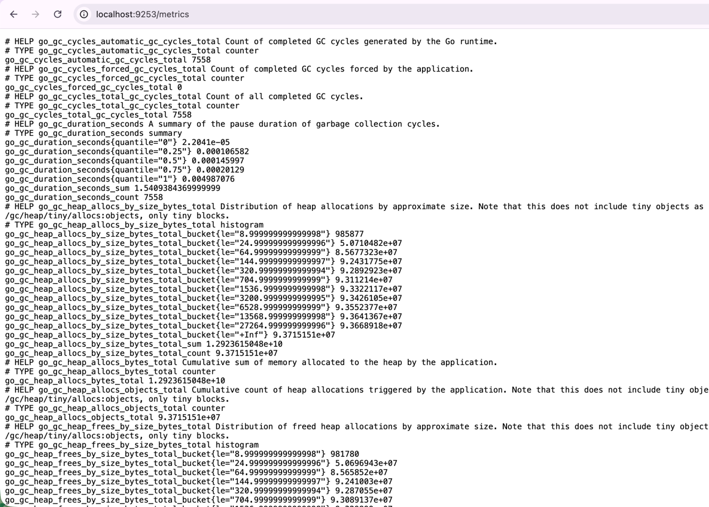
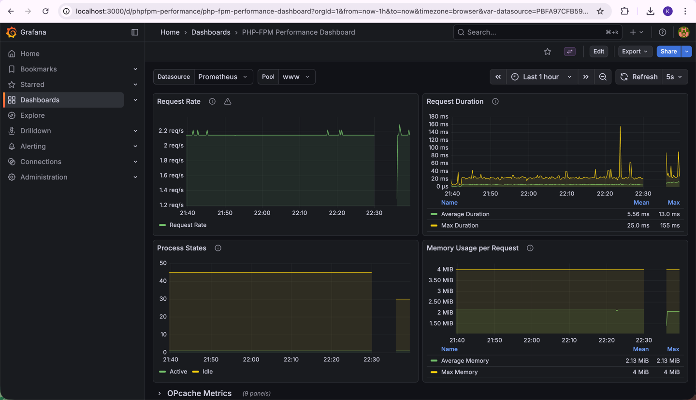

# PHP-FPM End-to-End Guide

## Boot Normal PHP with FPM

Start the PHP-FPM service using Docker Compose:

```bash
make up
```

This boots the FPM container with the configuration defined in `docker-compose.yml -> app: service`.

## FPM Settings & Configuration

PHP-FPM uses a process manager to handle incoming requests efficiently. The configuration is located in:
- `docker/fpm.conf` - FPM pool configuration
- `docker/nginx/aa-nginx.conf` - Nginx configuration

### Key Configuration Settings

```ini
pm = dynamic                    # Process manager type (static, dynamic, ondemand)
pm.max_children = 50            # Maximum number of child processes
pm.start_servers = 5            # Number of children created on startup
pm.min_spare_servers = 5        # Minimum idle processes
pm.max_spare_servers = 35       # Maximum idle processes
pm.max_requests = 500           # Requests before process restart (helps with memory leaks)
pm.status_path = /fpm-status    # FPM status endpoint
```

**Process Manager Types:**
- `static` - Fixed number of processes (best for consistent load)
- `dynamic` - Scales between min/max spare servers (good for variable load)
- `ondemand` - Creates processes on demand (best for low/intermittent traffic)

**Important:** `pm.start_servers = 5` means you will see **5 child processes** in `htop` when the container starts, plus 1 master process (total 6 PHP-FPM processes).

> Note: if you configure pm.min_spare_servers = 5 more than pm.start_servers = 5 it will fail

When you run `htop` or `ps aux | grep php-fpm`, you'll see:



```
1 × php-fpm: master process (manages child processes)
5 × php-fpm: pool www (child processes handling requests)
```

**Process Roles:**
- **Master Process** - Manages child processes, handles signals, doesn't serve requests
- **Child Processes** - Handle actual HTTP requests from nginx/web server
- **Dynamic Scaling** - Processes spawn/die based on load (between `min_spare_servers` and `max_spare_servers`)

**Process States:**
- `Idle` - Waiting for requests
- `Running` - Actively processing a request
- `Finishing` - Completing request cleanup
- `Reading headers` - Parsing request headers
- `Ending` - Process is shutting down

## FPM Math & Right-Sizing

PHP-FPM pool sizing is critical for optimal performance. You need to balance:
- Available RAM
- Expected concurrent requests
- Per-request memory usage
- Response time requirements

### Formula for `pm.max_children`

```
pm.max_children = (Total Available RAM - RAM for other services) / Average PHP Process Memory
```

### Example Calculation

```
Server RAM: 4GB (4096 MB)
System + MySQL: 1GB (1024 MB)
Average PHP process: 50 MB

pm.max_children = (4096 - 1024) / 50 = 61 processes
```

### Production Calculation (16GB Server)

**Server Specs:** 16GB RAM, 12GB reserved for applications

Using the [PM Calculator](https://spot13.com/pmcalculator/):

```
pm.max_children = 14
pm.start_servers = 3
pm.min_spare_servers = 3
pm.max_spare_servers = 10
```

**Calculation Breakdown:**
- **Total RAM:** 16GB
- **Reserved RAM:** 12GB
- **RAM Buffer:** 10%
- **Process Size:** 255MB
- **Formula:** `(12GB × 0.9) ÷ 255MB ≈ 14 processes`

**Process Lifecycle:**
1. **Startup:** 3 processes created immediately
2. **Minimum Spare:** Always keep 3 idle processes ready
3. **Maximum Spare:** Kill processes if more than 10 are idle
4. **Maximum Total:** Never exceed 14 processes

**Configuration Logic:**



## FPM Calculator Tool

Use the interactive calculator at https://spot13.com/pmcalculator/ to determine optimal settings:



Input your server specifications to get recommended FPM settings.

## K6 Load Testing

Run k6 load tests against the FPM endpoint:

```bash
make benchmark-product-random-fpm
```

Output:


This generates an HTML report:
```
k6/report-product-by-id-random-8088-2025-11-25T10-45-06.548Z.html
```

## Show FPM Status Page

The FPM status page shows real-time process information.

**Configuration:**

if we check this we will found a endpoint for fpm status

```
./docker/fpm.conf - pm.status_path = /fpm-status
./docker/nginx/aa-nginx.conf - location ~ ^/fpm-status$ { ... }
```

**Access the status page:**

http://localhost:8088/fpm-status



**Status Information:**
- Pool name and process manager type
- Start time and uptime
- Active/idle/total processes
- Max active processes reached
- Slow requests count
- Queue length

## FPM Exporter & Metrics

The FPM exporter converts FPM status data to Prometheus metrics format.

### Start FPM Exporter

```bash
make up-exporter
make ps | grep exporter
```

Go to **URL:** http://localhost:9253/metrics



**Key Metrics:**
- `phpfpm_up` - FPM service health (1=up, 0=down)
- `phpfpm_processes_total` - Total number of processes
- `phpfpm_active_processes` - Currently active processes
- `phpfpm_idle_processes` - Idle processes waiting for requests
- `phpfpm_max_active_processes` - Peak active processes
- `phpfpm_max_children_reached` - Times max_children limit hit
- `phpfpm_slow_requests` - Number of slow requests
- `phpfpm_accepted_connections` - Total accepted connections

## Prometheus Integration

Start Prometheus to scrape FPM exporter metrics:

```bash
make up-prometheus
make ps | grep prom
```

**View Prometheus targets:**

http://localhost:9090/targets?search=


Verify the FPM exporter target is "UP" and being scraped successfully.

## Grafana Dashboard for FPM

Grafana provides visual dashboards for FPM monitoring.

### Start Grafana

```bash
make up-grafana
make ps | grep grafana
```

### Access Grafana Dashboard

**URL:** http://localhost:3000/

**Credentials:**
- Username: `symfony`
- Password: `symfony`

### FPM Dashboard

Navigate to: **Dashboard → PHP-FPM Performance Dashboard**

**Direct URL:** http://localhost:3000/d/phpfpm-performance/php-fpm-performance-dashboard?orgId=1&from=now-5m&to=now&timezone=browser&var-datasource=PBFA97CFB590B2093&var-pool=www&refresh=5s



**Dashboard Panels:**
- FPM process states (active/idle/total)
- Request rate and duration
- Memory usage per process
- Connection queue length
- Max children reached alerts
- Slow request tracking

**Tip:** Set the time range to "Last 5 minutes" (left side) to see real-time data during load tests.

---

## Monitoring Commands (Run Inside Container During k6 Tests)
You can skip this section if you wish:

### Check Real-Time Process Usage

**List processes sorted by memory (RSS):**
```bash
ps -ylC php-fpm --sort:rss
```

**Watch process states in real-time:**
```bash
watch -n 1 'ps aux | grep php-fpm'
```

**Count active vs idle processes:**
```bash
curl -s http://localhost:8088/fpm-status | grep -E "active|idle"
```

### Calculate Process Memory

**Average memory per process (in MB):**
```bash
ps --no-headers -o "rss,cmd" -C php-fpm | awk '{ sum+=$1} END { print sum/NR/1024 }'
```

**Total memory usage by all PHP-FPM processes:**
```bash
ps --no-headers -o "rss,cmd" -C php-fpm | awk '{ sum+=$1 } END { print sum/1024 " MB" }'
```

**Memory usage per individual process:**
```bash
ps -o pid,rss,cmd -C php-fpm | awk 'NR>1 {print $1, $2/1024 " MB", $3}'
```

### Advanced Monitoring

**Get CPU usage by PHP-FPM:**
```bash
ps -C php-fpm -o %cpu,pid,cmd --no-headers
```

**Find the most memory-intensive PHP-FPM process:**
```bash
ps --no-headers -o "rss,pid,cmd" -C php-fpm | sort -rn | head -5
```

### Understanding the Output

**RSS (Resident Set Size):**
- Physical memory used by the process
- Shown in KB by default
- Divide by 1024 for MB

**VSZ (Virtual Memory Size):**
- Total virtual memory allocated
- Usually much larger than RSS
- Includes shared libraries

**Example Output Interpretation:**
```bash
$ ps -ylC php-fpm --sort:rss
  RSS    PID  CMD
52340  12345  php-fpm: master process
48512  12346  php-fpm: pool www
50240  12347  php-fpm: pool www
```

This shows:
- Master process using ~51 MB
- Child processes using ~47-49 MB each
- Total usage: ~150 MB for 3 processes

## Related Documentation

- [php.ini.md](php.ini.md) - PHP configuration and opcache settings
- [grafana-dashboard.md](grafana-dashboard.md) - Detailed Grafana dashboard documentation
- [README.md](README.md) - Main project documentation
