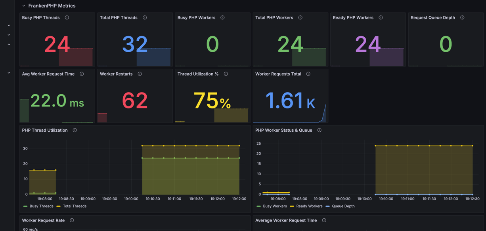

# FrankenPHP Configuration & Performance Testing

## Overview

This project uses FrankenPHP (a modern PHP runtime built on Caddy) with two different configurations for performance
comparison and monitoring.

### Bring it up

# up normal franken

```
make up-franken
```

Go to - https://localhost/

# up worker mode franken

```
make up-worker
```

Go to - https://localhost:444/

## Service Configuration

### FrankenPHP Services

| Service               | Port | Mode    | Caddyfile           | Purpose                      |
|-----------------------|------|---------|---------------------|------------------------------|
| **FrankenPHP**        | 443  | Regular | `Caddyfile.regular` | Traditional PHP server mode  |
| **FrankenPHP Worker** | 444  | Worker  | `Caddyfile`         | High-performance worker mode |

### Configuration Differences

**Regular Mode (`Caddyfile.regular`):**

- Uses traditional PHP server mode
- Good for development and simple applications
- Auto-reloads on file changes

**Worker Mode (`Caddyfile`):**

- Uses FrankenPHP worker mode for better performance
- Handles multiple requests concurrently
- Auto-reloads on file changes
- Better suited for production workloads

## Auto-Reload (File Watching)

Both FrankenPHP services can automatically reload PHP workers when your code changes, thanks to the `watch` directive in
the Caddyfile:

```caddyfile
frankenphp {
    worker {
        file ./public/index.php
        watch
    }
    php_ini memory_limit 512M
}
```

### How It Works

- The `watch` directive monitors your PHP source files for changes (saves, creates, deletes)
- When changes are detected, workers gracefully restart to load the new code
- No manual intervention or container restarts needed

### Watch Specific Paths

You can watch specific directories instead of all files:

```caddyfile
frankenphp {
    worker {
        file ./public/index.php
        watch ./app        # Watch app directory
        watch ./config     # Watch config directory
        watch ./routes     # Watch routes directory
    }
}
```

### Benefits

- **Development Speed**: See changes instantly without restarting containers
- **Zero Downtime**: Workers reload gracefully, maintaining active connections
- **Selective Watching**: Monitor only relevant directories to reduce overhead

### Important Considerations

- **Performance Impact**: File watching uses system resources (inotify on Linux)
- **Production Warning**: Always disable `watch` in production for stability
- **Large Projects**: Watching many files can impact performance

**Production Best Practice:**

```caddyfile
frankenphp {
    worker {
        file ./public/index.php
        # watch  # Commented out for production
        num 8   # Increase workers instead
    }
}
```

### Worker Metrics

When `metrics` is enabled, worker information is exposed at the metrics endpoint:

## View franken metrics for grafana

Go to - http://localhost:2020/metrics

```
# With num 1
frankenphp_total_workers{worker="/var/www/html/public/index.php"} 1

# With num 8
frankenphp_total_workers{worker="/var/www/html/public/index.php"} 8
```

- Access metrics at `http://localhost:2020/metrics` (or your configured admin port)
- The `frankenphp_total_workers` metric shows active workers per script
- Worker path reflects the `file` directive in your configuration
- Updates in real-time when workers are added/removed

## Caddy Configuration

Caddy configuration can be extended via environment variables in the docker-compose.yml:

```yaml
environment:
  CADDY_GLOBAL_OPTIONS: "admin 0.0.0.0:2019\nmetrics"
  SERVER_NAME: ":8080 https://localhost:443"
```

### Environment Variables Explained

#### `CADDY_GLOBAL_OPTIONS`

Injects global Caddy directives at the top of your configuration:

- `admin 0.0.0.0:2019` - Enables admin API on all interfaces
    - Access metrics at `http://localhost:2019/metrics`
    - Runtime config changes via API
    - **Security**: Use `admin localhost:2019` in production
- `metrics` - Enables Prometheus-compatible metrics endpoint
- Use `\n` for line breaks between multiple directives

#### `SERVER_NAME`

Defines which addresses/domains Caddy will serve:

- `:8080` - HTTP on port 8080 (all interfaces)
- `https://localhost:443` - HTTPS on localhost
- Can specify multiple: `example.com www.example.com`
- Caddy auto-provisions SSL certificates for domains

### Advanced Examples

#### Development Configuration

```caddyfile
{
    admin localhost:2019
    metrics
    debug
}

localhost:8080 {
    root public/
    encode gzip
    php_server
}
```

#### Production Configuration

```caddyfile
{
    admin off  # Disable admin API
}

example.com www.example.com {
    root /var/www/html
    encode zstd br gzip
    
    header {
        X-Frame-Options DENY
        X-Content-Type-Options nosniff
    }
    
    handle_errors {
        rewrite * /error.php
        php_server
    }
    
    php_server
}
```

#### Multi-site Configuration

```caddyfile
site1.com {
    root /var/www/site1/public
    php_server
}

site2.com {
    root /var/www/site2/public
    php_server
}

:8080 {
    root /var/www/default/public
    php_server
}
```

This approach keeps your Caddyfile clean while allowing per-deployment customization.

## Performance Testing & Monitoring

### Load Testing FrankenPHP Services

**Test FrankenPHP (Regular Mode - Database):**

```bash
make k6-franken-products-db
```

**Test FrankenPHP Worker Mode (Database):**

```bash
make k6-franken-worker-products-db
```

### Monitoring FrankenPHP Performance

**Real-time Metrics:**

- **FrankenPHP Metrics**: http://localhost:2019/metrics
- **Worker Metrics**: http://localhost:2020/metrics

**Key Metrics to Monitor:**

```bash
# FrankenPHP regular mode metrics
curl http://localhost:2019/metrics | grep frankenphp

# Worker mode metrics  
curl http://localhost:2020/metrics | grep frankenphp
```

**Important FrankenPHP Metrics:**

- `frankenphp_total_workers` - Number of active workers
- `frankenphp_requests_total` - Total requests processed
- `frankenphp_request_duration_seconds` - Request processing time
- `frankenphp_memory_usage_bytes` - Memory consumption

### Grafana Dashboard for FrankenPHP

**Access Grafana Dashboard:**

- URL: http://localhost:3000
- Username: `croatia`
- Password: `croatia`

**FrankenPHP Monitoring Panels:**

1. **Worker Count**: Shows active FrankenPHP workers
2. **Request Rate**: Requests per second for each service
3. **Response Time**: Average response times
4. **Memory Usage**: Memory consumption per worker
5. **Error Rate**: Failed requests percentage

### Performance Comparison Testing

**Step 1: Baseline Testing**

```bash
# Test regular FrankenPHP (database)
make k6-franken-products-db
# Check results in k6/report-franken-*.html

# Test worker mode (database)
make k6-franken-worker-products-db
# Check results in k6/report-worker-*.html
```

**Step 2: Monitor in Grafana**

- Compare request rates between services
- Monitor memory usage differences
- Check response time variations
- Observe worker scaling behavior

**Step 3: Analyze Results**

- Worker mode typically shows better concurrency
- Regular mode may have lower memory overhead
- Response times vary based on load patterns

### FrankenPHP Configuration Testing

**Test Auto-Reload (Development):**

```bash
# Make a code change and watch workers reload
echo "// Test change" >> src/Controller/ProductController.php

# Check metrics for worker restart
curl http://localhost:2019/metrics | grep frankenphp_total_workers
```

**Test Worker Scaling:**

```bash
# Monitor worker count during load
watch -n 1 'curl -s http://localhost:2019/metrics | grep frankenphp_total_workers'

# Run load test in another terminal
k6 run k6/list_products.js --env BASE_URL=https://localhost:443/en
```

## Troubleshooting FrankenPHP

### Common Issues:

1. **Workers not starting**: Check Caddyfile syntax
2. **High memory usage**: Adjust `num_threads` and `memory_limit`
3. **Slow response times**: Monitor worker count and scaling
4. **Auto-reload not working**: Verify `watch` directive in Caddyfile

### Debug Commands:

```bash
# Check FrankenPHP logs
docker-compose logs franken

# Check worker mode logs
docker-compose logs franken-worker

# Verify configuration
docker-compose exec franken cat /etc/frankenphp/Caddyfile
docker-compose exec franken-worker cat /etc/frankenphp/Caddyfile
```

## Performance Optimization

### Resource Configuration Guidelines

The appropriate values depend heavily on how your application is written, what it does and your hardware.
It is recommended to have `num_threads` × `memory_limit` < `available_memory`.

https://frankenphp.dev/docs/performance/#number-of-threads-and-workers

### Calculating Optimal Configuration

```caddyfile
{
    frankenphp {
        num_threads 16      # Number of PHP threads
        worker {
            num 8           # Number of worker processes
        }
        php_ini memory_limit 256M
    }
}
```

#### Memory Calculation Example

- **Available Memory**: 8GB (8192MB)
- **PHP memory_limit**: 256MB
- **num_threads**: 16
- **Total PHP Memory**: 16 × 256MB = 4096MB (4GB)
- **Remaining for OS/Caddy**: 4GB ✓

### Performance Optimization Tips

**For Development:**

- Use `watch` directive for auto-reload
- Keep `num_threads` low (2-4) for faster startup
- Monitor memory usage with `memory_limit`

**For Production:**

- Disable `watch` directive
- Increase `num_threads` based on CPU cores
- Set appropriate `memory_limit` per thread
- Use worker mode for better concurrency

**Memory Calculation Formula:**

```
Total Memory = num_threads × memory_limit + OS_overhead
Recommended: Total Memory < Available System Memory × 0.8
```

### Worker Count Optimization Strategy

```
# Your current setup analysis
# Available RAM calculation for optimal worker count
TOTAL_RAM=16384MB
RESERVED_RAM=2400MB    # OS, Caddy, Redis, MySQL
AVAILABLE_RAM=$(($TOTAL_RAM - $RESERVED_RAM))
PHP_MEMORY_LIMIT=512MB  # Your current setting

# Optimal worker calculation
OPTIMAL_WORKERS=$(($AVAILABLE_RAM / $PHP_MEMORY_LIMIT))
# Example: 13984MB / 512MB = ~27 workers

# Test with your existing setup
make k6-franken-worker-products-db  # Baseline test
# Then adjust num in Caddyfile and retest
```

### CPU-Based Thread Tuning

Update Caddyfile

```
# Enhanced Caddyfile configuration for your setup
{
	admin 0.0.0.0:2019
	metrics

	frankenphp {
		# Advanced worker configuration
        num_threads 32        # 2x your CPU cores (adjust based on load testing)
        worker {
            file ./public/index.php
            num 24            # Based on memory calculation above
            watch             # Keep for development
        }

		# Optimized PHP settings for FrankenPHP
        php_ini {
            memory_limit 512M
            opcache.memory_consumption 256
            opcache.interned_strings_buffer 16
            opcache.max_accelerated_files 20000
            opcache.validate_timestamps 0  # Production only
            opcache.save_comments 0        # Production only
        }
	}
}

{$SERVER_NAME:localhost} {
    root /var/www/html/public

    # Enable compression (optional)
    encode zstd br gzip

	{$CADDY_SERVER_EXTRA_DIRECTIVES}

    # Execute PHP files in the current directory and serve assets
	php_server
}

```

Run this to restart configuration

```bash
make down-worker && make up-worker
```

Go to http://localhost:2020/metrics

```ini
# HELP frankenphp_busy_threads Number of busy PHP threads
# TYPE frankenphp_busy_threads gauge
frankenphp_busy_threads 24
# HELP frankenphp_busy_workers Number of busy PHP workers for this worker
# TYPE frankenphp_busy_workers gauge
frankenphp_busy_workers{worker="/var/www/html/public/index.php"} 0
# HELP frankenphp_queue_depth Number of regular queued requests
# TYPE frankenphp_queue_depth gauge
frankenphp_queue_depth 0
# HELP frankenphp_ready_workers Running workers that have successfully called frankenphp_handle_request at least once
# TYPE frankenphp_ready_workers gauge
frankenphp_ready_workers{worker="/var/www/html/public/index.php"} 24
# HELP frankenphp_total_threads Total number of PHP threads
# TYPE frankenphp_total_threads counter
frankenphp_total_threads 32
# HELP frankenphp_total_workers Total number of PHP workers for this worker
# TYPE frankenphp_total_workers gauge
frankenphp_total_workers{worker="/var/www/html/public/index.php"} 24
# HELP frankenphp_worker_request_count 
# TYPE frankenphp_worker_request_count counter
frankenphp_worker_request_count{worker="/var/www/html/public/index.php"} 1
# HELP frankenphp_worker_request_time 
# TYPE frankenphp_worker_request_time counter
frankenphp_worker_request_time{worker="/var/www/html/public/index.php"} 0.285840084
```

Run k6 tests

```
make k6-franken-worker-products-db
```

Check Grafana



### Dynamic Worker Scaling

```
{
	admin 0.0.0.0:2019
	metrics

    frankenphp {
        num_threads 16
        max_threads auto    # Dynamic scaling based on load
        worker {
            file ./public/index.php
            num 8           # Starting workers
        }

        # Memory-based scaling configuration
        php_ini memory_limit 512M
    }
}

{$SERVER_NAME:localhost} {
	root {$SERVER_ROOT:public/}
	encode zstd br gzip


	{$CADDY_SERVER_EXTRA_DIRECTIVES}

	php_server
}

```

if you make max_threads lesser than `num_threads` it will going to error like this

```
docker compose logs franken-worker
```

you will see  this

```
franken-worker-1  | Error: adapting config using caddyfile: parsing caddyfile tokens for 'frankenphp': "max_threads"" must be greater than or equal to "num_threads"
```

if we set to auto meaning that will increase the num thread dynamic

`num_threads` must be greater than worker `num` directive otherwise it will throw same error

## k6 test

This project includes comprehensive k6 load testing commands for FrankenPHP performance evaluation. All tests use the
existing Makefile targets for consistent and reproducible testing.

### Available k6 Test Commands

#### FrankenPHP (Regular Mode - Port 443)

```bash
# Products testing
make k6-franken-products-db        # Test products DB endpoint
make k6-franken-products-redis     # Test products Redis endpoint

# Customers testing
make k6-franken-customers-db       # Test customers DB endpoint
make k6-franken-customers-redis    # Test customers Redis endpoint

# Orders testing
make k6-franken-orders-db          # Test orders DB endpoint
make k6-franken-orders-redis       # Test orders Redis endpoint
```

#### FrankenPHP Worker Mode (Port 444)

```bash
# Products testing
make k6-franken-worker-products-db        # Test products DB endpoint
make k6-franken-worker-products-redis     # Test products Redis endpoint

# Customers testing
make k6-franken-worker-customers-db       # Test customers DB endpoint
make k6-franken-worker-customers-redis    # Test customers Redis endpoint

# Orders testing
make k6-franken-worker-orders-db          # Test orders DB endpoint
make k6-franken-worker-orders-redis       # Test orders Redis endpoint
```

### Batch Testing Commands

**Run all tests against FrankenPHP (Regular Mode):**

```bash
make k6-all-franken
```

**Run all tests against FrankenPHP Worker Mode:**

```bash
make k6-all-franken-worker
```

**Run all tests against all environments (FPM, FrankenPHP, FrankenPHP Worker):**

```bash
make k6-all-environments
```

### Performance Comparison Testing

#### Step 1: Individual Endpoint Testing

```bash
# Test products endpoint on both FrankenPHP modes (database)
make k6-franken-products-db
make k6-franken-worker-products-db

# Compare results in generated HTML reports
# Check: k6/report-*.html files
```

#### Step 2: Database vs Redis Performance

```bash
# Test database performance
make k6-franken-products-db
make k6-franken-worker-products-db

# Test Redis projection performance  
make k6-franken-products-redis
make k6-franken-worker-products-redis

# Compare response times and throughput
```

## Load Testing Scenarios

### FPM MySQL Read

**Products:**

```bash
make k6-fpm-products-db
```

**Customers:**

```bash
make k6-fpm-customers-db
```

**Orders:**

```bash
make k6-fpm-orders-db
```

**Grafana Setup:**

1. Go to http://localhost:3000/dashboards
2. Click `PHP-FPM Performance Dashboard`
3. Select Datasource to Prometheus
4. Select Pool to www

### FPM Projection Read

**Products:**

```bash
make rebuild-products  # Rebuild data redis to projection from Seeder
make k6-fpm-products-redis
```

**Customers:**

```bash
make rebuild-customers  # Rebuild data redis to projection from Seeder
make k6-fpm-customers-redis
```

**Orders:**

```bash
make rebuild-orders  # Rebuild data redis to projection from Seeder
make k6-fpm-orders-redis
```

**Grafana Setup:**

1. Go to http://localhost:3000/dashboards
2. Click `PHP-FPM Performance Dashboard`
3. Select Datasource to Prometheus
4. Select Pool to www

### FrankenPHP MySQL Read

**Products:**

```bash
make k6-franken-products-db
```

**Customers:**

```bash
make k6-franken-customers-db
```

**Orders:**

```bash
make k6-franken-orders-db
```

**Grafana Setup:**

1. Go to http://localhost:3000/dashboards
2. Click `Caddy`
3. Select Job to `Caddy`
4. Select instance to `franken:2019`
5. Set Last 5 minutes at `Top right` button
6. Set Refresh 5s

### FrankenPHP Projection Read

**Products:**

```bash
make k6-franken-products-redis
```

**Customers:**

```bash
make k6-franken-customers-redis
```

**Orders:**

```bash
make k6-franken-orders-redis
```

**Grafana Setup:**

1. Go to http://localhost:3000/dashboards
2. Click `Caddy`
3. Select Job to `Caddy`
4. Select instance to `franken:2019`
5. Set Last 5 minutes at `Top right` button
6. Set Refresh 5s

### FrankenPHP Worker MySQL Read

**Products:**

```bash
make k6-franken-worker-products-db
```

**Customers:**

```bash
make k6-franken-worker-customers-db
```

**Orders:**

```bash
make k6-franken-worker-orders-db
```

**Grafana Setup:**

1. Go to http://localhost:3000/dashboards
2. Click `Caddy`
3. Select Job to `Caddy`
4. Select instance to `franken-worker:2019`
5. Set Last 5 minutes at `Top right` button
6. Set Refresh 5s

### FrankenPHP Worker Projection Read

**Products:**

```bash
make k6-franken-worker-products-redis
```

**Customers:**

```bash
make k6-franken-worker-customers-redis
```

**Orders:**

```bash
make k6-franken-worker-orders-redis
```

**Grafana Setup:**

1. Go to http://localhost:3000/dashboards
2. Click `Caddy`
3. Select Job to `Caddy`
4. Select instance to `franken-worker:2019`
5. Set Last 5 minutes at `Top right` button
6. Set Refresh 5s

#### Step 3: Monitor Real-time Metrics

During k6 testing, monitor FrankenPHP metrics:

```bash
# FrankenPHP regular mode metrics
curl http://localhost:2019/metrics | grep frankenphp

# Worker mode metrics
curl http://localhost:2020/metrics | grep frankenphp
```

### Grafana Dashboard

**Monitor during k6 testing:**

1. **Access Grafana**: http://localhost:3000 (croatia/croatia)
2. **FrankenPHP Panels**: Worker count, request rate, response time
3. **Real-time Updates**: Watch metrics change during load tests

**Key Dashboard Panels:**

- **Worker Count**: `frankenphp_total_workers`
- **Request Rate**: `frankenphp_requests_total`
- **Response Time**: `frankenphp_request_duration_seconds`
- **Memory Usage**: `frankenphp_memory_usage_bytes`

### Test Configuration

**Environment Variables Used:**

- `FRANKEN_URL`: https://localhost:443 (FrankenPHP regular mode)
- `FRANKEN_WORKER_URL`: https://localhost:444 (FrankenPHP worker mode)
- `FPM_URL`: http://localhost:8088 (PHP-FPM for comparison)

**k6 Test Scripts:**

- `k6/list_products.js` - Products endpoint testing
- `k6/list_products_db.js` - Database query testing
- `k6/list_products_redis.js` - Redis projection testing
- `k6/list_customers.js` - Customers endpoint testing
- `k6/list_orders.js` - Orders endpoint testing
- `k6/loadtest.js` - Blog/load testing

### Utility Commands

**Clean test reports:**

```bash
make k6-clean-reports
```

**Install k6 (if not installed):**

```bash
make k6-install
```

**View all available k6 commands:**

```bash
make help
```