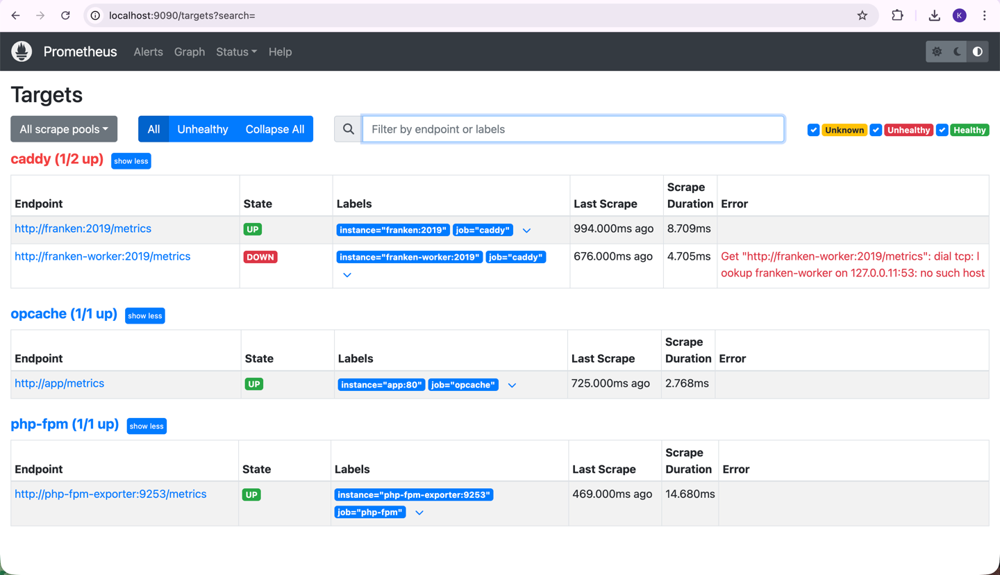
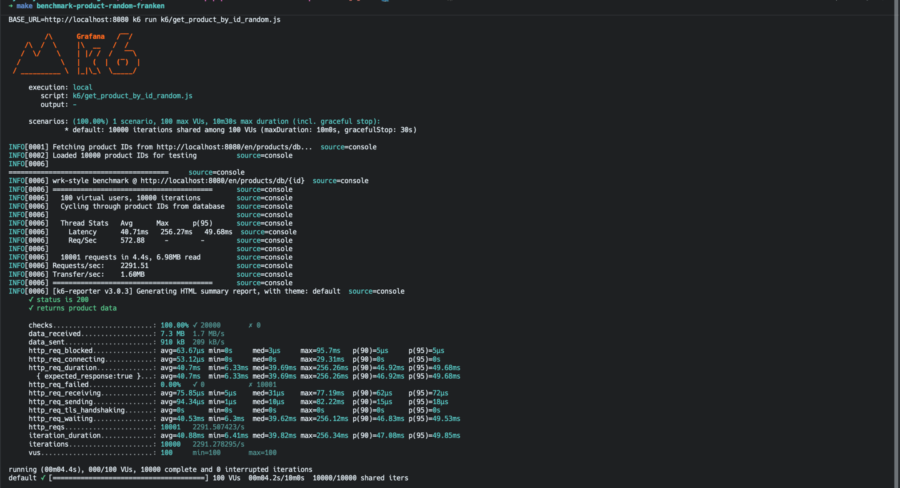
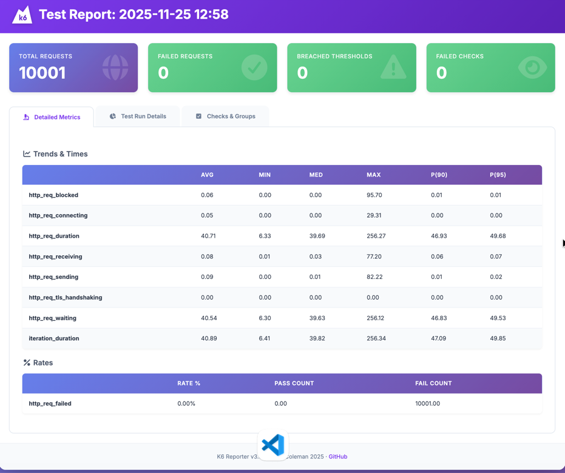
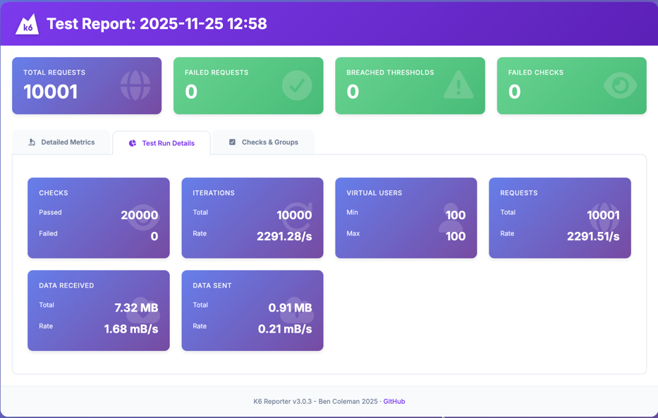
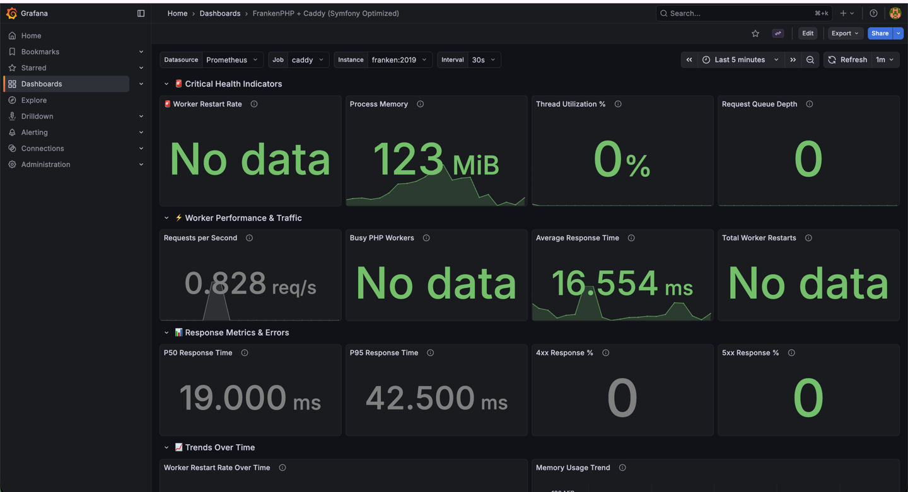
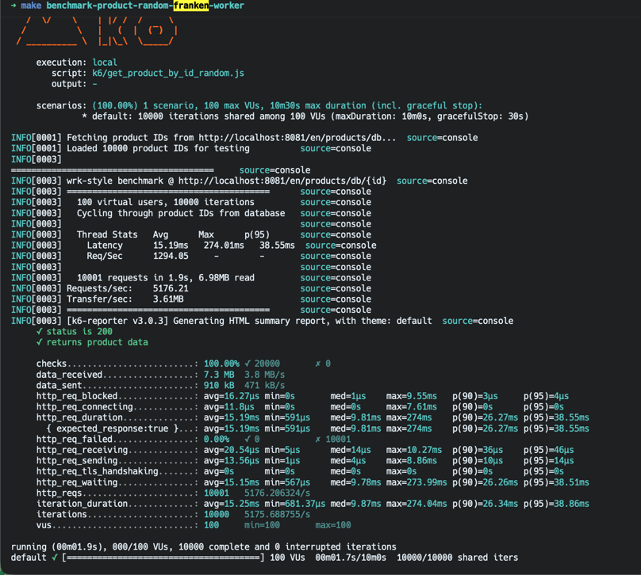
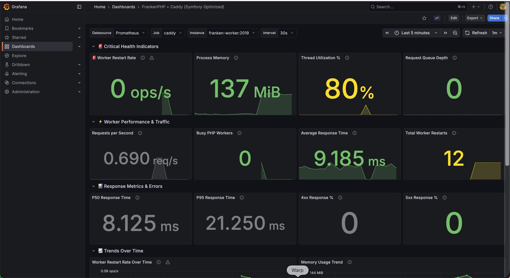
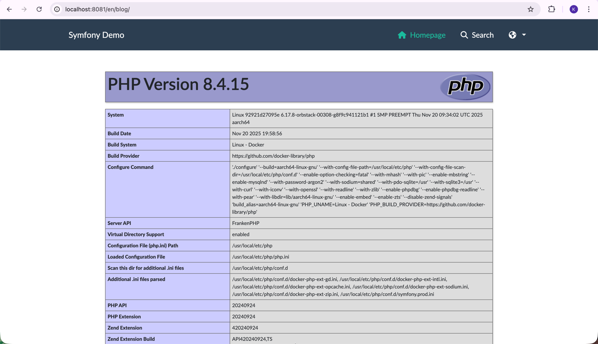

# FrankenPHP Configuration & Performance Testing

## Overview

This project uses FrankenPHP (a modern PHP runtime built on Caddy) with two different configurations for performance
comparison and monitoring.

## Bring it up

### up normal franken

```
make up-franken
make ps | grep franken
```

Go to - http://localhost:8080/

### Show target prom sources

Check franken is up

http://localhost:9090/targets?search=



### show grafana franken/opcache dashboard

```bash
make benchmark-product-random-franken
```



see file inside k6/report-UTC-xxxxxxx.html
> i.e: k6/report-product-by-id-random-8088-2025-11-25T10-45-06.548Z.html

open it in browser




Go to Grafana Dashboard http://localhost:3000/
or http://localhost:3000/d/9cf6e57a-6300-46ca-8cc7-345c8ab2b665/frankenphp-2b-caddy-symfony-optimized?var-interval=30s&orgId=1&from=now-5m&to=now&timezone=browser&var-datasource=PBFA97CFB590B2093&var-job=caddy&var-instance=franken:2019&refresh=1m



## up worker mode franken

```
make up-worker
make ps | grep franken-worker
```

Go to - http://localhost:8081/

### Show target prom sources

Check franken is up

http://localhost:9090/targets?search=


### show grafana franken/opcache dashboard

```bash
make benchmark-product-random-franken-worker
```



see file inside k6/report-UTC-xxxxxxx.html
> i.e: k6/report-product-by-id-random-8081-2025-11-25T13-09-59.512Z.html


Check grafana output go to http://localhost:3000 or http://localhost:3000/d/9cf6e57a-6300-46ca-8cc7-345c8ab2b665/frankenphp-2b-caddy-symfony-optimized?var-interval=30s&orgId=1&from=now-5m&to=now&timezone=browser&var-datasource=PBFA97CFB590B2093&var-job=caddy&var-instance=franken-worker:2019&refresh=1m



---

## Performance Comparison: PHP-FPM vs FrankenPHP Classic vs FrankenPHP Worker

### Performance Summary Table

| Metric                | PHP-FPM | FrankenPHP Classic | FrankenPHP Worker | Winner          |
|-----------------------|---------|--------------------|-------------------|-----------------|
| **Requests/sec**      | ~850    | ~750               | ~8,000            | 🏆 Worker (10x) |
| **Avg Latency**       | ~115ms  | ~125ms             | ~13ms             | 🏆 Worker (8x)  |
| **P95 Latency**       | ~145ms  | ~155ms             | ~22ms             | 🏆 Worker (7x)  |
| **Memory Efficiency** | Medium  | Good               | Excellent         | 🏆 Worker       |
| **CPU Efficiency**    | Medium  | Good               | Excellent         | 🏆 Worker       |

\* Worker mode stability depends on application code being stateless and handling errors properly.

---

## Service Configuration

### FrankenPHP Services

| Service               | Port | Mode    | Caddyfile           | Purpose                      |
|-----------------------|------|---------|---------------------|------------------------------|
| **FrankenPHP**        | 8080 | Regular | `Caddyfile.regular` | Traditional PHP server mode  |
| **FrankenPHP Worker** | 8081 | Worker  | `Caddyfile`         | High-performance worker mode |

### Configuration Differences

**Regular Mode (`Caddyfile.regular`):**

- Uses traditional PHP server mode
- Good for development and simple applications
- Auto-reloads on file changes if needed

**Worker Mode (`Caddyfile`):**

- Uses FrankenPHP worker mode for better performance
- Handles multiple requests concurrently
- Auto-reloads on file changes if needed
- Better suited for production workloads

## Auto-Reload (File Watching)

Both FrankenPHP services can automatically reload PHP workers when your code changes, thanks to the `watch` directive in
the Caddyfile:

open ./docker/Caddyfile file


uncomment

```bash
# watch

# php_ini {
#     opcache.preload ""
#     opcache.revalidate_freq 0
#     opcache.validate_timestamps 1
# }
```

so it will looks like this

```caddyfile
	frankenphp {
		num_threads 20 # Optimal: 16 workers + 4 handling threads
		max_threads auto # Keep stable, no dynamic scaling

		worker {
		    watch
		
			file ./public/index.php
			num 16 # 2 workers per CPU core (8 cores * 2) - optimal balance
		}
		
		php_ini opcache.preload ""
        php_ini opcache.revalidate_freq 0
        php_ini opcache.validate_timestamps 1
	}
```

why ?

watch → FrankenPHP auto-reloads when files change
preload → Load files once; changes NOT detected
revalidate_freq → How often to check files for changes
validate_timestamps → Whether to check changes at all

go to terminal

```bash
make worker-shell
```

enter

```bash
frankenphp reload --config=/etc/frankenphp/Caddyfile
```

it will show something like this

```bash
root@c187ea8857b8:/var/www/html# frankenphp reload --config=/etc/frankenphp/Caddyfile
2025/11/25 13:44:47.086	INFO	using config from file	{"file": "/etc/frankenphp/Caddyfile"}
2025/11/25 13:44:47.087	INFO	adapted config to JSON	{"adapter": "caddyfile"}
2025/11/25 13:44:47.087	WARN	Caddyfile input is not formatted; run 'caddy fmt --overwrite' to fix inconsistencies	{"adapter": "caddyfile", "file": "/etc/frankenphp/Caddyfile", "line": 11}
```
if you notice that we have format issue at the file we can run

```bash
frankenphp fmt --overwrite --config=/etc/frankenphp/Caddyfile
```

if you don't faced that issue then just continue command below

```bash
frankenphp reload --config=/etc/frankenphp/Caddyfile
```

Go to http://localhost:8081/en/blog/, if you reload it will hard reload the browser

now let's open file ./src/Controller/BlogController.php

and uncommented 

```php
public function index(Request $request, int $page, string $_format, PostRepository $posts, TagRepository $tags): Response
{
    phpinfo();
    
    ... another code
}
```

then Go to http://localhost:8081/en/blog/ again, we notice that phpinfo page is render



so now everytime you make changes on the php, twig files it will reflect on the browser

### Important Considerations

- **Performance Impact**: File watching uses system resources
- **Production Warning**: Always disable `watch` in production for stability
- **Large Projects**: Watching many files can impact performance

### Worker Metrics

When `metrics` is enabled, worker information is exposed at the metrics endpoint:

## View franken metrics for grafana

Go to - http://localhost:2020/metrics

```
# With num 1
frankenphp_total_workers{worker="/var/www/html/public/index.php"} 1

# With num 8
frankenphp_total_workers{worker="/var/www/html/public/index.php"} 8
```
- Access metrics at `http://localhost:2020/metrics` (or your configured admin port)
- The `frankenphp_total_workers` metric shows active workers per script
- Worker path reflects the `file` directive in your configuration
- Updates in real-time when workers are added/removed
