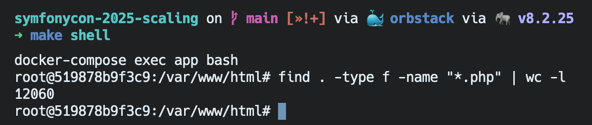
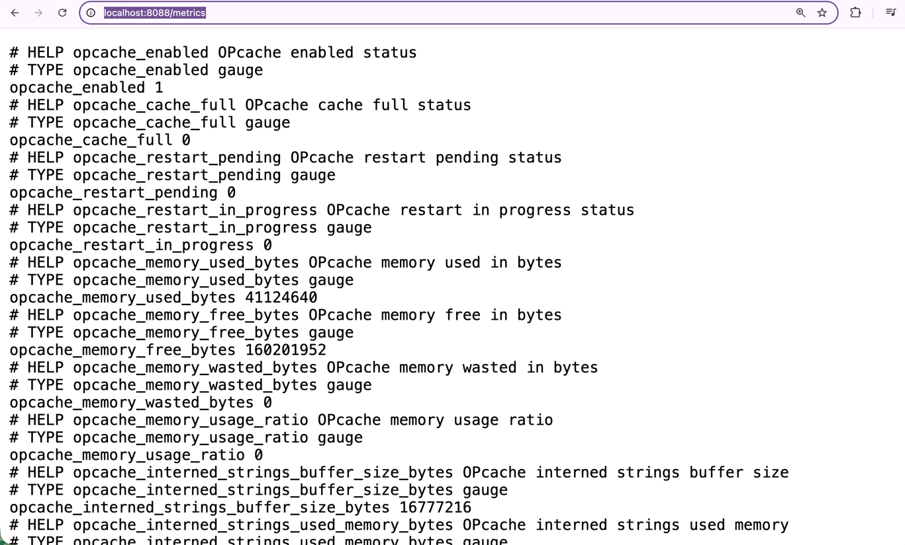
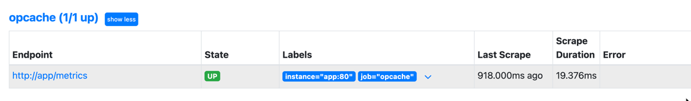
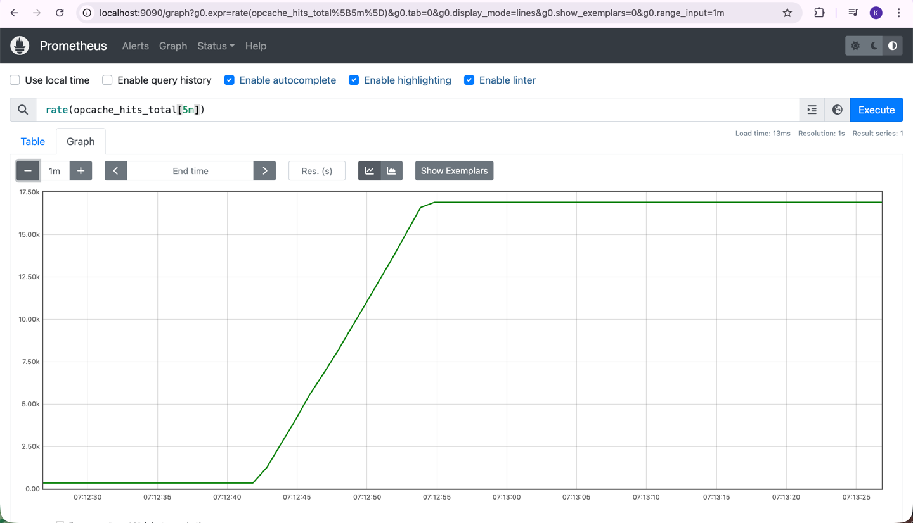
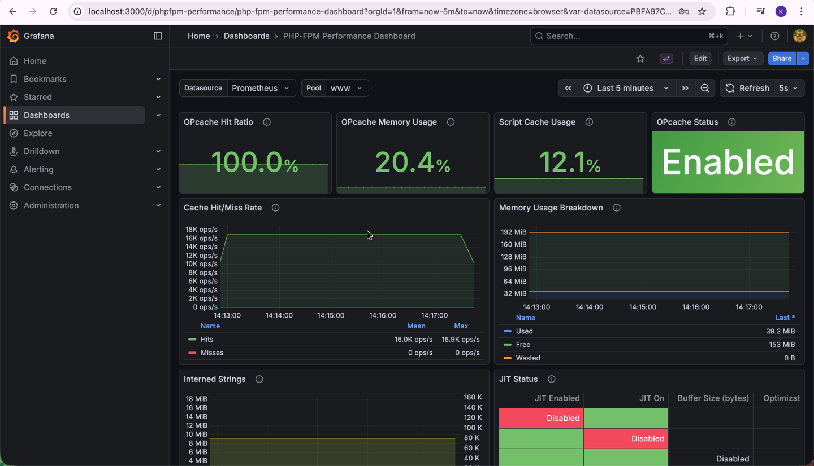

# PHP OPcache

This guide provides a complete walkthrough of PHP OPcache setup, configuration, monitoring, and optimization.

## Boot and Show Dashboard

Start the application and OPcache dashboard:

```bash
make up
```

### Access OPcache Dashboard

```bash
make up-opcache-dashboard
make ps | grep opcache-dashboard
```

Go to **URL:** http://localhost:42042


The OPcache dashboard provides real-time visualization of:
- Memory usage (used vs free)
- Cache hit rate
- Cached scripts count
- OPcache statistics
- Interned strings information
- Configuration settings

## PHP OPcache .ini Settings

OPcache configuration is located in `./docker/symfony.prod.ini`.

- [Enable Settings](#enable-settings) - Basic OPcache activation
- [Validation Settings](#validation-settings) - File modification checking
- [Memory Configuration](#memory-configuration) - Memory and file limits
- [Performance Optimizations](#performance-optimizations) - Speed enhancements
- [Preloading](#preloading) - Startup file loading

#### Enable Settings

```ini
opcache.enable=1
opcache.enable_cli=1
```

**Purpose:** Enables OPcache for web requests and CLI scripts.

**How It Works:**
1. PHP file requested
2. OPcache checks if bytecode exists in memory
3. If exists → Use cached bytecode
4. If not → Compile and cache bytecode
5. Serve request

#### Validation Settings

```ini
opcache.validate_timestamps=0
opcache.revalidate_freq=0
```

**Purpose:** Controls whether OPcache checks if PHP files have been modified since they were cached.

**How It Works:**

With `opcache.validate_timestamps=1` (development):
1. PHP file requested
2. OPcache checks: "Has this file been modified since I cached it?"
3. If modified → Recompile and cache new version
4. If unchanged → Use cached bytecode
5. Serve request

With `opcache.validate_timestamps=0` (production):
1. PHP file requested
2. OPcache: "I have this cached, use it" (no timestamp check)
3. Serve request immediately

**Production Setting:** `validate_timestamps=0` for maximum performance
**Development Setting:** `validate_timestamps=1` to see code changes immediately

#### Memory Configuration

```ini
opcache.max_accelerated_files=12060
opcache.memory_consumption=192
opcache.interned_strings_buffer=16
```

**File Count Calculation:**

```bash
make shell
find . -type f -name "*.php" | wc -l
```



**Purpose:** Ensures OPcache can handle all project files.

**How It Works:**
- **max_accelerated_files:** 16,087 files can be cached
- **memory_consumption:** 192MB allocated for bytecode storage
- **interned_strings_buffer:** 16MB for storing duplicate strings once

**Important Notes on opcache.max_accelerated_files:**

`opcache.max_accelerated_files` **must be a prime number**.

If you set a value that is not prime, PHP will automatically calculate and use the next prime number above your value. The value **must be higher than the number of files in your application**; otherwise, the setting is useless and may cause issues.

#### Performance Optimizations

```ini
opcache.fast_shutdown=1
opcache.enable_file_override=1
```

**Purpose:** Additional performance improvements.

**How It Works:**
- **fast_shutdown:** Faster process termination
- **enable_file_override:** Caches `file_exists()`, `is_file()` results

#### Preloading

```ini
opcache.preload_user=www-data
opcache.preload=/var/www/html/config/preload.php
```

**Purpose:** Preloads frequently-used files into memory at startup.

**How It Works:**

**Without preloading:**
- `$composer->findFileWithExtension()` transforms class name into file name, then looks it up
- Expensive lookup time on every request

**With preloading:**
- Loads all specified files into memory in one go at startup
- Keeps them in memory for the entire process lifetime
- Eliminates autoloader overhead for preloaded classes

**Performance Impact:** Significant reduction in autoloading overhead for frequently-used classes

## Metrics Endpoint to Export

OPcache metrics are exposed via the FPM application.

**URL:** http://localhost:8088/metrics

This endpoint provides Prometheus-compatible metrics including:
- `opcache_enabled` - Whether OPcache is enabled
- `opcache_full` - Whether OPcache memory is full
- `opcache_hit_rate` - Cache hit rate percentage
- `opcache_memory_usage_used_memory` - Used memory in bytes
- `opcache_memory_usage_free_memory` - Free memory in bytes
- `opcache_memory_usage_wasted_memory` - Wasted memory in bytes
- `opcache_interned_strings_buffer_used_memory` - Interned strings memory usage
- `opcache_cached_scripts` - Number of cached scripts
- `opcache_num_cached_keys` - Number of cached keys
- `opcache_max_cached_keys` - Maximum number of cached keys
- `opcache_hits` - Number of cache hits
- `opcache_misses` - Number of cache misses
- `opcache_oom_restarts` - Out-of-memory restart count
- `opcache_hash_restarts` - Hash collision restart count
- `opcache_manual_restarts` - Manual restart count

### Opcache Metric 

since we already ran this command `make up` so we can check opcache metrics
go to http://localhost:8088/metrics



### Prometheus URL for OPcache Settings

Prometheus scrapes the metrics endpoint and stores historical data.

### Start Prometheus

```bash
make up-prometheus
make ps | grep prom
```

### Access Prometheus

Go to http://localhost:9090/targets?search=



it's already up

### Query OPcache Metrics

run benchmark again

```bash
make benchmark-product-random-fpm
```

Go to http://localhost:9090/graph

Navigate to the Prometheus query interface and run queries like:

```
rate(opcache_hits_total[5m])
```



## Grafana URL for OPcache Settings

Grafana provides visual dashboards for OPcache monitoring.

### Start Grafana

```bash
make up-grafana
make ps | grep grafana
```

### Access Grafana Dashboard

let it spinning for awhile

**URL:** http://localhost:3000/

**Credentials:**
- Username: `symfony`
- Password: `symfony`

### OPcache Dashboard Panels

Navigate to: **Dashboard → PHP-FPM Performance Dashboard**



The dashboard includes dedicated OPcache panels:

**OPcache Hit Ratio:**
- Current hit rate percentage
- Color-coded: Green (>95%), Yellow (85-95%), Red (<85%)
- Shows cache efficiency

**OPcache Memory Usage:**
- Used vs Free memory visualization
- Wasted memory tracking
- Memory consumption trends

**OPcache Cache Statistics:**
- Number of cached scripts
- Cache keys utilization
- Max cached keys capacity

**OPcache JIT (if enabled):**
- JIT buffer usage
- JIT compilation statistics

**OPcache Interned Strings:**
- Interned strings memory usage
- Buffer utilization percentage

**OPcache Restart Monitoring:**
- OOM (Out of Memory) restarts
- Hash collision restarts
- Manual restarts

**Tip:** Set the time range to "Last 5 minutes" to see real-time data during load tests.

## Additional PHP Configuration

The following sections cover other important PHP configuration settings in `./docker/symfony.prod.ini`.

### Memory Management

#### Memory Limit
```ini
memory_limit=512M
```
**Purpose:** Sets the maximum amount of memory a PHP script can consume.

**How It Works:**
1. PHP process starts
2. Script begins execution
3. Memory usage monitored continuously
4. If limit exceeded → Fatal error: "Allowed memory size exhausted"
5. Process terminates to protect server

**Resource Protection:** Prevents runaway scripts from consuming all available RAM on 16GB server.

#### Upload Configuration
```ini
upload_max_filesize=50M
post_max_size=76M
```
**Purpose:** Controls file upload limits and POST data size.

**How It Works:**
- `upload_max_filesize`: Maximum size for individual uploaded files
- `post_max_size`: Maximum size for entire POST request (must be larger)

**Upload Flow:**
1. User selects 50MB file
2. Browser sends POST request with file + form data
3. PHP checks `post_max_size` first (76MB) → ✓ Allow
4. PHP checks `upload_max_filesize` (50MB) → ✓ Allow
5. File processed successfully

### Execution Control

#### Execution Time
```ini
max_execution_time=300
```
**Purpose:** Prevents scripts from running indefinitely.

**How It Works:**
1. Script execution begins
2. Timer starts (300 seconds = 5 minutes)
3. If timer expires → Fatal error: "Maximum execution time exceeded"
4. Process terminates

**Use Cases:** Data imports/exports, complex calculations, API synchronization, report generation

### Security Configuration

#### PHP Information Disclosure
```ini
expose_php=0
```
**Purpose:** Hides PHP version from HTTP headers.

**How It Works:**
- With `expose_php=1`: HTTP response includes `X-Powered-By: PHP/8.2.0`
- With `expose_php=0`: No PHP version header sent

**Security Benefit:** Attackers cannot easily identify PHP version vulnerabilities

#### Code Compatibility
```ini
short_open_tag=Off
```
**Purpose:** Enforces full PHP opening tags.

**How It Works:**
- **Disabled:** Only `<?php` tags work
- **Enabled:** Both `<?php` and `<?` tags work
- **XML Conflict Prevention:** `<?xml version="1.0"?>` won't be mistaken for PHP code

### Internationalization

#### Timezone Configuration
```ini
date.timezone="US/Eastern"
```
**Purpose:** Sets default timezone for all date/time functions.

**How It Works:**
1. PHP function called: `date('Y-m-d H:i:s')`
2. No timezone specified → Uses `date.timezone` setting
3. Returns time in US/Eastern timezone
4. Prevents "It is not safe to rely on the system's timezone settings" warnings

#### Locale Settings
```ini
intl.default_locale="en"
```
**Purpose:** Default locale for internationalization functions.

**How It Works:**
- Number formatting: `1234.56` vs `1.234,56`
- Currency display: `$1,234.56` vs `€1.234,56`
- Text collation: Sorting order for strings

#### Unicode Detection
```ini
zend.detect_unicode=0
```
**Purpose:** Disables automatic Unicode detection for performance.

**How It Works:**
- **Enabled:** PHP checks each file for Unicode BOM (Byte Order Mark)
- **Disabled:** Skips Unicode detection → Faster file processing

**Trade-off:** Manual Unicode handling required but performance gained

### Session Management

#### Session Lifetime
```ini
session.gc_maxlifetime=7200
```
**Purpose:** Controls how long session data survives.

**How It Works:**
1. User logs in → Session created with timestamp
2. User inactive for 7200 seconds (2 hours)
3. Garbage collector runs → Removes expired session
4. Next request → Session not found, user must re-authenticate

#### Session Startup
```ini
session.auto_start=Off
```
**Purpose:** Prevents automatic session initialization.

**How It Works:**
- **Auto-start Off:** Sessions created only when `session_start()` called
- **Auto-start On:** Session created for every request

**Performance Benefit:** Saves resources on pages that don't need sessions

### Security Functions

#### Disabled Functions
```ini
disable_functions=apache_child_terminate,apache_get_modules,apache_note,apache_setenv,define_syslog_variables,disk_total_space,diskfreespace,dl,escapeshellcmd,eval,get_current_user,getlastmo,getmygid,getmyinode,getmypid,getmyuid,ini_restore,pcntl_alarm,pcntl_exec,pcntl_fork,pcntl_get_last_error,pcntl_getpriority,pcntl_setpriority,pcntl_signal,pcntl_signal_dispatch,pcntl_sigprocmask,pcntl_sigtimedwait,pcntl_sigwaitinfo,pcntl_strerrorp,pcntl_wait,pcntl_waitpid,pcntl_wexitstatus,pcntl_wifexited,pcntl_wifsignaled,pcntl_wifstopped,pcntl_wstopsig,pcntl_wtermsig,posix_getlogin,posix_kill,posix_mkfifo,posix_setpgid,posix_setsid,posix_setuid,posix_ttyname,posix_uname,posixc,proc_nice,proc_terminate,ps_aux,runkit_function_rename,show_source,syslog,system
```
**Purpose:** Disables potentially dangerous PHP functions.

**Security Categories:**
- **Process Control:** `pcntl_*` functions - Prevents process manipulation
- **System Access:** `system`, `exec` - Blocks command execution
- **File System:** `show_source`, `disk_total_space` - Limits file access
- **Apache Functions:** `apache_*` - Prevents Apache configuration access
- **Code Injection:** `eval` - Blocks dynamic code execution

### Performance Optimization

#### Realpath Cache
```ini
realpath_cache_size=4096K
realpath_cache_ttl=600
```
**Purpose:** Caches resolved file paths to reduce filesystem lookups.

**How It Works:**
1. PHP requests file: `src/Controller/ProductController.php`
2. System resolves symlinks and relative paths
3. Result cached for 600 seconds (10 minutes)
4. Subsequent requests use cached path
5. Reduces I/O operations significantly

**Performance Reference:** [Symfony Performance Guide](https://symfony.com/doc/current/performance.html)

## Related Documentation

- [fpm.md](fpm.md) - PHP-FPM configuration and monitoring
- [grafana-dashboard.md](grafana-dashboard.md) - Detailed Grafana dashboard documentation
- [README.md](README.md) - Main project documentation
