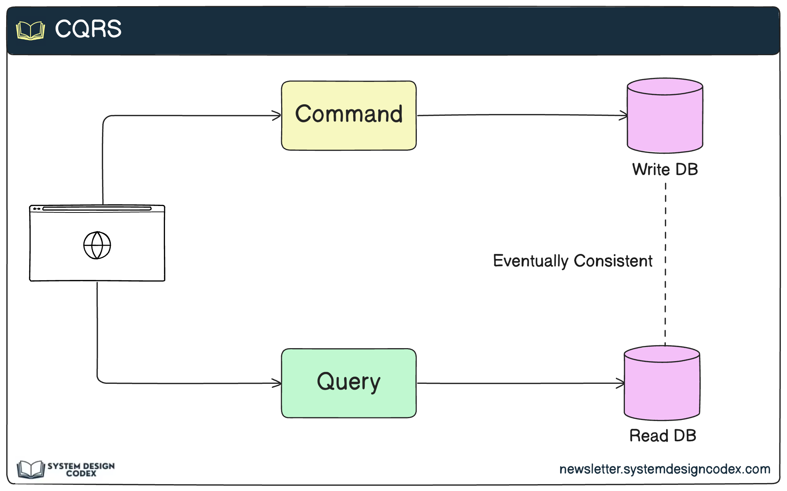
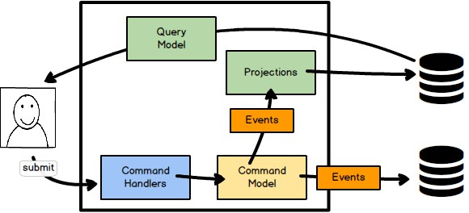
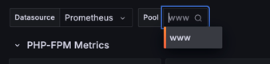
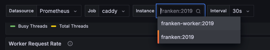
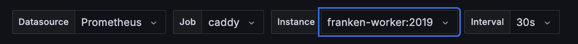
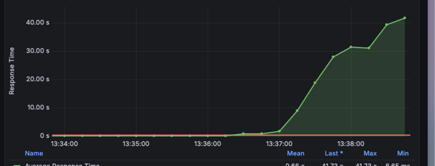
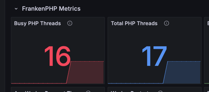

# CQRS Architecture Overview

CQRS (Command Query Responsibility Segregation) is a pattern that separates read and write operations into different models, using commands to update data and queries to read data. This enables scalability, flexibility, and can improve performance for complex systems.

Below are two diagrams illustrating the CQRS architecture:

---



*In this diagram:*
- **Command Handlers** process user commands and update the **Command Model**.
- The **Command Model** emits **Events** that update **Projections** (the read model).
- **Query Model** and **Projections** are used to serve read requests efficiently.
- Separate databases can be used for reads and writes.

---



*In this diagram:*
- Commands update the **Write DB**.
- Queries read from the **Read DB**.
- The read and write sides are eventually consistent.

---

> In this project, projections are used as the read model, built from events generated by the command model. This allows for fast, scalable queries while keeping the write model optimized for transactional integrity.

---

## Rebuild projections (Redis):

Go to http://localhost:8088/en/products/db
Go to http://localhost:8088/en/products/projection

# Move data into projection
Run this command

```bash
make rebuild-projections
```

## Run load test against it

### fpm MySQL read
Run this command

```bash
make k6-fpm-products-db
```

Go to http://localhost:3000/dashboards

Click `PHP-FPM Performance Dashboard`



1. Select Datasource to Prometheus
2. Select Pool to www

### read from projection
Run this command

```bash
make rebuild-products // Rebuilding data redis to projection from Seeder 
make k6-fpm-products-redis
```
Go to http://localhost:3000/dashboards

Click `PHP-FPM Performance Dashboard`


1. Select Datasource to Prometheus
2. Select Pool to www

### franken MySQL read
Run this command

```bash
make k6-franken-products-db
```

Go to http://localhost:3000/dashboards

Click `Caddy`



1. Select Job to `Caddy`
2. Select instance to `franken:2019`
3. Set Last 5 minutes at `Top right` button
4. Set Refresh 5s

### franken Projection read
Run this command

```bash
make k6-franken-products-redis
```

Go to http://localhost:3000/dashboards

Click `Caddy`


1. Select Job to `Caddy`
2. Select instance to `franken-worker:2019`
3. Set Last 5 minutes at `Top right` button
4. Set Refresh 5s

### Franken Worker MySQL Read
Run this command

```bash
make k6-franken-worker-products-db
```

Go to http://localhost:3000/dashboards

Click `Caddy`


1. Select Job to `Caddy`
2. Select instance to `franken-worker:2019`
3. Set Last 5 minutes at `Top right` button
4. Set Refresh 5s

### Franken Worker Projection Read

Run this command

```bash
make k6-franken-worker-products-redis
```

Go to http://localhost:3000/dashboards

Click `Caddy`



1. Select Job to `Caddy`
2. Select instance to `franken-worker:2019`
3. Set Last 5 minutes at `Top right` button
4. Set Refresh 5s

let's try another endpoint that reload relationship 

```bash
make rebuild-orders
make k6-franken-worker-orders-redis
```

try see again http://localhost:3000/dashboards

it will have slow response time



let's scale the num of workers in Caddyfile

change num 1 to more workers

```
{
	admin 0.0.0.0:2019
	metrics

	frankenphp {
		worker {
			file ./public/index.php
			watch
			num 16 # change number of worker
		}

		php_ini memory_limit 512M
	}
}
```

let's restart the configuration

```bash
make down-worker && make up-worker
```

after changes you will see in the dashboard from FrankenPHP Metrics section



retry again the k6 to see different in Grafana worker dashboard

```bash
make k6-franken-worker-products-db
```

Go to the http://localhost:3000 dashboard to check

### Product Projections
- **Entity**: `ProductProjection`
- **Repository**: `ProductProjectionRepository`
- **Service**: `ProductProjectionService`
- **Builder**: `ProductProjectionBuilder`

### Customer Projections
- **Entity**: `CustomerProjection`
- **Repository**: `CustomerProjectionRepository`
- **Service**: `CustomerProjectionService`
- **Builder**: `CustomerProjectionBuilder`

### Order Projections
- **Entity**: `OrderProjection`
- **Repository**: `OrderProjectionRepository`
- **Service**: `OrderProjectionService`
- **Builder**: `OrderProjectionBuilder`
- 
## API Endpoints

### Database Endpoints (Write Model)
```
GET /en/products/db       # List all products from database
GET /en/customers/db      # List all customers from database
GET /en/orders/db         # List all orders from database
```

### Redis Projection Endpoints (Read Model)

#### Products
- `GET /en/products/projection` - List all products from Redis projections
- `GET /en/products/projection/{id}` - Get specific product from Redis projections
- `PUT /en/products/{id}` - Update product (database + Redis projection)
- `DELETE /en/products/{id}` - Delete product (database + Redis projection)
- `POST /en/products` - Create new product (database + Redis projection)

#### Customers
- `GET /en/customers/projection` - List all customers from Redis projections
- `GET /en/customers/projection/{id}` - Get specific customer from Redis projections
- `POST /en/customers` - Create new customer (database + Redis projection)
- `DELETE /en/customers/{id}` - Delete customer (database + Redis projection)

#### Orders
- `GET /en/orders/projection` - List all orders from Redis projections
- `GET /en/orders/projection/{id}` - Get specific order from Redis projections
- `POST /en/orders` - Create new order (database + Redis projection)
- `DELETE /en/orders/{id}` - Delete order (database + Redis projection)

## Projection Management

### Rebuild Projections

**Rebuild all projections:**
```bash
make rebuild-projections
```

**Rebuild individual projections:**
```bash
make rebuild-products      # Rebuild product projections only
make rebuild-customers     # Rebuild customer projections only
make rebuild-orders        # Rebuild order projections only
```

### Database vs Redis Performance

**Test Database Performance:**
```bash
# FPM
make k6-fpm-products-db
make k6-fpm-customers-db
make k6-fpm-orders-db

# FrankenPHP
make k6-franken-products-db
make k6-franken-customers-db
make k6-franken-orders-db

# FrankenPHP Worker
make k6-franken-worker-products-db
make k6-franken-worker-customers-db
make k6-franken-worker-orders-db
```

**Test Redis Projection Performance:**
```bash
# FPM
make k6-fpm-products-redis
make k6-fpm-customers-redis
make k6-fpm-orders-redis

# FrankenPHP
make k6-franken-products-redis
make k6-franken-customers-redis
make k6-franken-orders-redis

# FrankenPHP Worker
make k6-franken-worker-products-redis
make k6-franken-worker-customers-redis
make k6-franken-worker-orders-redis

## Known Issues

### Slow Redis Performance Issue

There is currently a known issue with slow Redis performance in the projection system. When running load tests against Redis projections, you may experience significantly slower response times compared to expected performance.

**See if you can figure out why** - This could be related to:
- Redis connection pooling configuration
- Serialization/deserialization overhead
- Memory usage patterns
- Network latency between application and Redis
- Redis server configuration optimization

To investigate this issue:
1. Monitor Redis metrics during load tests
2. Check Redis server logs for any errors or warnings
3. Analyze the projection service implementation
4. Review Redis connection handling in the application
