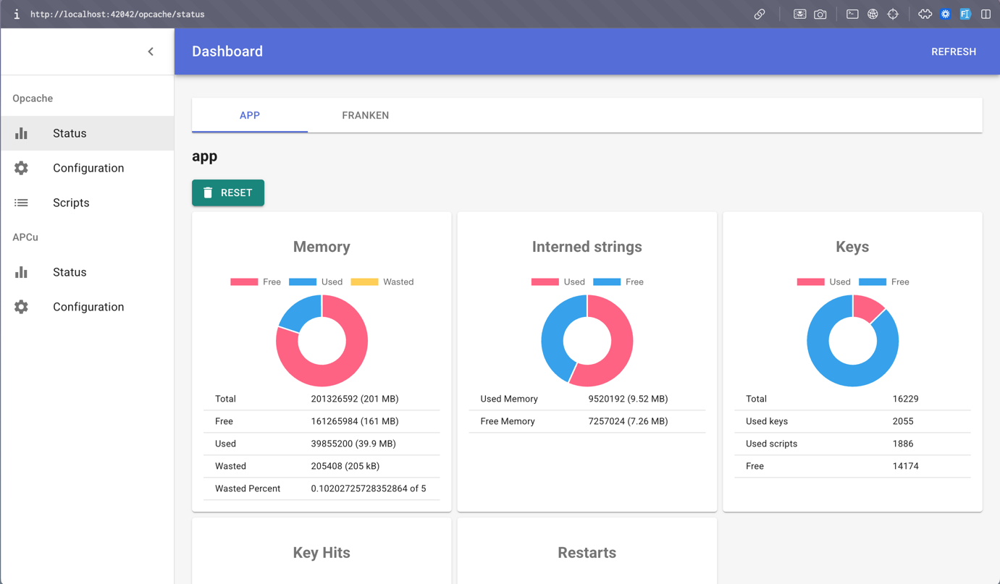

### opcache introduction

```
make up-opcache-dashboard
```

open - http://localhost:42042/opcache/status



https://www.php.net/manual/en/opcache.configuration.php#:~:text=on%20all%20architectures.-,opcache.max_accelerated_files,-int

```
find . -type f -name "*.php" | wc -l
```

```
opcache.max_accelerated_files=16087
```

Prime Number: 10000 -> 10007 (nearest prime)
